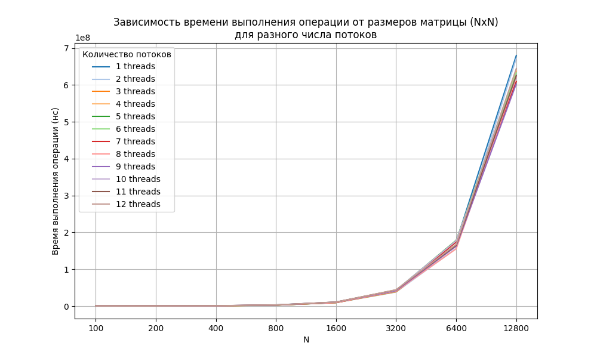
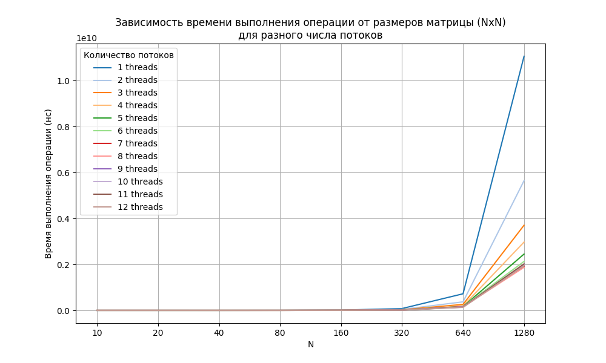
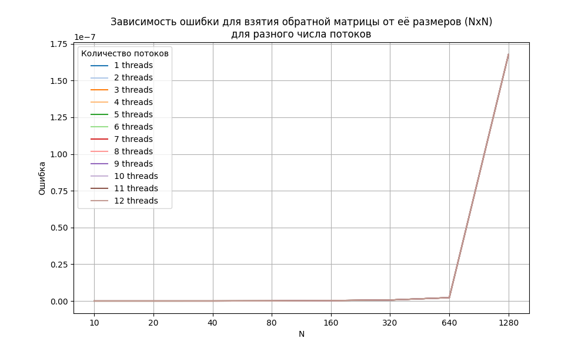
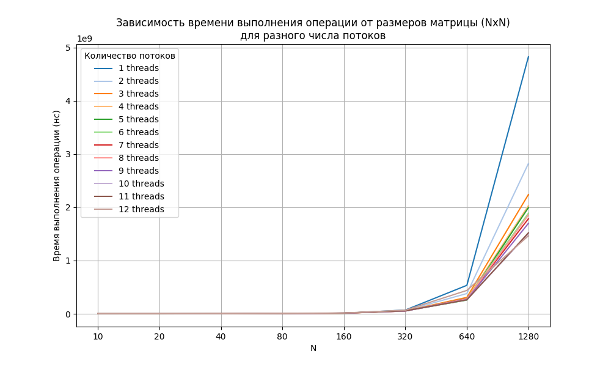

# Результаты тестов

Характеристики железа: 6 ядер, 12 логических процессоров.

---
## Операция сложения матриц:

### Параметры запуска:
- `NUM_THREADS`: 12
- `N_MIN`: 100
- `NUM_MATRICES`: 7

```bash
.\Matrix_2024.exe NUM_THREADS=12 N_MIN=100 NUM_MATRICES=7 TEST_MODE="SUM" PATH_OUTPUT="output/sum_results.txt"
```

### Результаты расчётов (время работы):

Далее представленна таблица при разном размере матрицы и числе потоков, содержащая время необходимое для сложения матрицы:

|     N |        1 |        2 |        3 |        4 |        5 |        6 |        7 |        8 |        9 |       10 |       11 |       12 |
|------:|---------:|---------:|---------:|---------:|---------:|---------:|---------:|---------:|---------:|---------:|---------:|---------:|
|   100 | 2.67e+04 | 1.06e+05 | 1.86e+05 | 2.30e+05 | 3.71e+05 | 3.46e+05 | 3.27e+05 | 5.08e+05 | 4.48e+05 | 4.67e+05 | 5.45e+05 | 5.50e+05 |
|   200 | 1.40e+05 | 2.24e+05 | 2.20e+05 | 3.16e+05 | 3.58e+05 | 3.09e+05 | 4.40e+05 | 4.78e+05 | 5.77e+05 | 5.31e+05 | 6.22e+05 | 6.57e+05 |
|   400 | 8.31e+05 | 5.51e+05 | 5.90e+05 | 6.90e+05 | 8.82e+05 | 7.96e+05 | 8.14e+05 | 9.41e+05 | 1.04e+06 | 1.05e+06 | 1.04e+06 | 1.02e+06 |
|   800 | 3.31e+06 | 2.71e+06 | 2.60e+06 | 2.75e+06 | 2.62e+06 | 2.67e+06 | 2.69e+06 | 3.07e+06 | 2.80e+06 | 2.97e+06 | 2.98e+06 | 3.19e+06 |
|  1600 | 1.06e+07 | 9.42e+06 | 9.75e+06 | 9.24e+06 | 9.45e+06 | 9.31e+06 | 9.43e+06 | 9.55e+06 | 1.09e+07 | 1.09e+07 | 1.10e+07 | 1.09e+07 |
|  3200 | 4.27e+07 | 3.81e+07 | 3.87e+07 | 4.26e+07 | 4.28e+07 | 3.94e+07 | 4.03e+07 | 4.07e+07 | 4.19e+07 | 4.33e+07 | 4.40e+07 | 4.44e+07 |
|  6400 | 1.74e+08 | 1.57e+08 | 1.65e+08 | 1.68e+08 | 1.78e+08 | 1.77e+08 | 1.74e+08 | 1.55e+08 | 1.62e+08 | 1.77e+08 | 1.65e+08 | 1.67e+08 |
| 12800 | 6.80e+08 | 6.72e+08 | 6.35e+08 | 6.39e+08 | 6.23e+08 | 6.33e+08 | 6.09e+08 | 6.21e+08 | 6.03e+08 | 6.23e+08 | 6.25e+08 | 6.44e+08 |

А также графики (с линейной и логарифмической осью ординат):



.png)


### Выводы:
- Простое сложение чисел — это слишком легкая задача для параллелизации, время выполнения доминируется накладными расходами на управление потоками, поэтому время выполнения операции не зависит от числа потоков.


---
## Операция умножения матриц:
- `NUM_THREADS`: 12
- `N_MIN`: 10
- `NUM_MATRICES`: 7

```bash
.\Matrix_2024.exe NUM_THREADS=12 N_MIN=10 NUM_MATRICES=7 TEST_MODE="PROD" PATH_OUTPUT="output/prod_results.txt"
```

### Результаты расчётов (время работы):

Далее представленна таблица при разном размере матрицы и числе потоков, содержащая время необходимое для произведения матрицы:

|    N |        1 |        2 |        3 |        4 |        5 |        6 |        7 |        8 |        9 |       10 |       11 |       12 |
|-----:|---------:|---------:|---------:|---------:|---------:|---------:|---------:|---------:|---------:|---------:|---------:|---------:|
|   10 | 7.30e+03 | 1.15e+05 | 2.09e+05 | 1.98e+05 | 4.52e+05 | 4.41e+05 | 4.93e+05 | 6.89e+05 | 5.82e+05 | 6.11e+05 | 7.39e+05 | 7.44e+05 |
|   20 | 5.77e+04 | 1.02e+05 | 2.34e+05 | 2.02e+05 | 2.67e+05 | 3.80e+05 | 3.95e+05 | 4.67e+05 | 6.16e+05 | 6.60e+05 | 6.56e+05 | 7.49e+05 |
|   40 | 2.16e+05 | 2.08e+05 | 1.56e+05 | 1.61e+05 | 2.13e+05 | 3.34e+05 | 3.14e+05 | 3.80e+05 | 4.27e+05 | 4.52e+05 | 5.36e+05 | 5.30e+05 |
|   80 | 1.22e+06 | 6.54e+05 | 4.89e+05 | 4.32e+05 | 5.58e+05 | 4.07e+05 | 4.83e+05 | 5.19e+05 | 6.13e+05 | 6.13e+05 | 6.87e+05 | 6.52e+05 |
|  160 | 9.44e+06 | 4.72e+06 | 3.27e+06 | 2.71e+06 | 2.37e+06 | 2.67e+06 | 2.75e+06 | 2.36e+06 | 1.98e+06 | 2.13e+06 | 2.00e+06 | 2.19e+06 |
|  320 | 7.96e+07 | 4.05e+07 | 2.66e+07 | 2.00e+07 | 2.35e+07 | 2.06e+07 | 1.80e+07 | 1.66e+07 | 1.50e+07 | 1.38e+07 | 1.28e+07 | 1.22e+07 |
|  640 | 7.22e+08 | 3.71e+08 | 2.59e+08 | 1.91e+08 | 1.66e+08 | 1.61e+08 | 1.62e+08 | 1.50e+08 | 1.54e+08 | 1.48e+08 | 1.41e+08 | 1.33e+08 |
| 1280 | 1.11e+10 | 5.65e+09 | 3.71e+09 | 2.97e+09 | 2.45e+09 | 2.13e+09 | 1.92e+09 | 1.87e+09 | 1.97e+09 | 2.00e+09 | 2.02e+09 | 1.94e+09 |

А также графики (с линейной и логарифмической осью ординат):



.png)


### Выводы:
- Умножение чисел — это уже не такая легкая задача для параллелизации как сложение, её время выполнения не доминируется накладными расходами на управление потоками, поэтому время выполнения операции зависит от числа потоков.
- Эффективность параллелизма зависит от размера задачи. При небольших размерах матриц накладные расходы на управление потоками превышают выгоду от их использования. Поэтому параллелизация оказалась даже медленнее последовательного исполнения при небольших $N$.


---
## Операция обращения матрицы:
Делал по ["Курсу вычислительных методов" С.П.Шарый](http://mathscinet.ru/files/SShary.pdf), стр. 156 - 165

### Параметры запуска:
- `NUM_THREADS`: 12
- `N_MIN`: 10
- `NUM_MATRICES`: 7

```bash
.\Matrix_2024.exe NUM_THREADS=12 N_MIN=10 NUM_MATRICES=7 TEST_MODE="INV" PATH_OUTPUT="inv_results.txt"
```

### Результаты расчётов:

#### Погрешность вычислений:
Пусть у нас есть матрица $A$, а матрица $A_{inv}$ - её обратная полученная через численные методы, тогда норма ошибки будет выглядеть следующим образом:

$$err = ||E - A*A_{inv}||_{\infty}$$

Чем она ближе к 0, тем лучше. Далее представленна таблица при разном размере матрицы и числе потоков:

|    N |        1 |        2 |        3 |        4 |        5 |        6 |        7 |        8 |        9 |       10 |       11 |       12 |
|-----:|---------:|---------:|---------:|---------:|---------:|---------:|---------:|---------:|---------:|---------:|---------:|---------:|
|   10 | 1.58e-12 | 1.58e-12 | 1.58e-12 | 1.58e-12 | 1.58e-12 | 1.58e-12 | 1.58e-12 | 1.58e-12 | 1.58e-12 | 1.58e-12 | 1.58e-12 | 1.58e-12 |
|   20 | 6.41e-14 | 6.41e-14 | 6.41e-14 | 6.41e-14 | 6.41e-14 | 6.41e-14 | 6.41e-14 | 6.41e-14 | 6.41e-14 | 6.41e-14 | 6.41e-14 | 6.41e-14 |
|   40 | 3.22e-12 | 3.22e-12 | 3.22e-12 | 3.22e-12 | 3.22e-12 | 3.22e-12 | 3.22e-12 | 3.22e-12 | 3.22e-12 | 3.22e-12 | 3.22e-12 | 3.22e-12 |
|   80 | 4.28e-11 | 4.28e-11 | 4.28e-11 | 4.28e-11 | 4.28e-11 | 4.28e-11 | 4.28e-11 | 4.28e-11 | 4.28e-11 | 4.28e-11 | 4.28e-11 | 4.28e-11 |
|  160 | 2.89e-10 | 2.89e-10 | 2.89e-10 | 2.89e-10 | 2.89e-10 | 2.89e-10 | 2.89e-10 | 2.89e-10 | 2.89e-10 | 2.89e-10 | 2.89e-10 | 2.89e-10 |
|  320 | 6.62e-10 | 6.62e-10 | 6.62e-10 | 6.62e-10 | 6.62e-10 | 6.62e-10 | 6.62e-10 | 6.62e-10 | 6.62e-10 | 6.62e-10 | 6.62e-10 | 6.62e-10 |
|  640 | 2.26e-09 | 2.26e-09 | 2.26e-09 | 2.26e-09 | 2.26e-09 | 2.26e-09 | 2.26e-09 | 2.26e-09 | 2.26e-09 | 2.26e-09 | 2.26e-09 | 2.26e-09 |
| 1280 | 1.68e-07 | 1.68e-07 | 1.68e-07 | 1.68e-07 | 1.68e-07 | 1.68e-07 | 1.68e-07 | 1.68e-07 | 1.68e-07 | 1.68e-07 | 1.68e-07 | 1.68e-07 |

А также графики (с линейной и логарифмической осью ординат):



.png)

#### Время работы:

Далее представленна таблица при разном размере матрицы и числе потоков, содержащая время необходимое для обращния матрицы:

|    N |        1 |        2 |        3 |        4 |        5 |        6 |        7 |        8 |        9 |       10 |       11 |       12 |
|-----:|---------:|---------:|---------:|---------:|---------:|---------:|---------:|---------:|---------:|---------:|---------:|---------:|
|   10 | 1.28e+04 | 1.34e+05 | 2.18e+05 | 2.70e+05 | 3.36e+05 | 3.69e+05 | 4.43e+05 | 4.71e+05 | 4.25e+05 | 4.99e+05 | 7.80e+05 | 6.56e+05 |
|   20 | 1.50e+05 | 1.88e+05 | 2.47e+05 | 2.72e+05 | 3.17e+05 | 3.83e+05 | 4.40e+05 | 4.91e+05 | 5.49e+05 | 6.40e+05 | 6.98e+05 | 7.21e+05 |
|   40 | 2.68e+05 | 5.61e+05 | 6.50e+05 | 8.53e+05 | 8.86e+05 | 9.15e+05 | 9.14e+05 | 9.62e+05 | 1.02e+06 | 1.11e+06 | 1.24e+06 | 1.72e+06 |
|   80 | 1.35e+06 | 2.33e+06 | 2.72e+06 | 2.88e+06 | 2.53e+06 | 3.36e+06 | 2.86e+06 | 3.11e+06 | 3.09e+06 | 3.43e+06 | 3.30e+06 | 9.94e+06 |
|  160 | 9.20e+06 | 1.11e+07 | 1.08e+07 | 1.05e+07 | 1.21e+07 | 1.13e+07 | 1.13e+07 | 1.22e+07 | 1.27e+07 | 1.25e+07 | 1.37e+07 | 1.40e+07 |
|  320 | 7.03e+07 | 5.94e+07 | 5.38e+07 | 6.13e+07 | 5.65e+07 | 5.40e+07 | 5.33e+07 | 5.25e+07 | 5.22e+07 | 5.41e+07 | 5.49e+07 | 6.80e+07 |
|  640 | 5.34e+08 | 3.80e+08 | 3.08e+08 | 2.82e+08 | 2.58e+08 | 2.88e+08 | 2.84e+08 | 2.79e+08 | 2.67e+08 | 2.62e+08 | 2.62e+08 | 4.39e+08 |
| 1280 | 4.82e+09 | 2.82e+09 | 2.24e+09 | 2.03e+09 | 1.99e+09 | 1.89e+09 | 1.78e+09 | 1.85e+09 | 1.70e+09 | 1.51e+09 | 1.52e+09 | 1.46e+09 |

А также графики (с линейной и логарифмической осью ординат):



.png)

### Выводы:
- С увеличением числа потоков время работы уменьшается, но не линейно.
- Эффективность параллелизма зависит от размера задачи. При небольших размерах матриц накладные расходы на управление потоками превышают выгоду от их использования. Поэтому параллелизация оказалась даже медленнее последовательного исполнения при небольших $N$.
- Норма ошибки остается в пределах погрешности вычислений, не зависимо от количества потоков.

