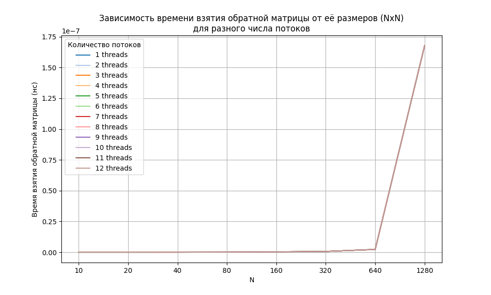

# Результаты тестов

Характеристики железа: 6 ядер, 12 логических процессоров.

## Параметры запуска:
- `NUM_THREADS`: 12
- `N_MIN`: 10
- `NUM_MATRICES`: 7

```bash
.\Matrix_2024.exe NUM_THREADS=12 N_MIN=10 NUM_MATRICES=7 PATH_OUTPUT="results.txt"
```

## Результаты расчётов:

### Погрешность вычислений:
Пусть у нас есть матрица $A$, а матрица $A_{inv}$ - её обратная полученная через численные методы, тогда норма ошибки будет выглядеть следующим образом:

$$err = ||E - A*A_{inv}||_{\infty}$$

Чем она ближе к 0, тем лучше. Далее представленна таблица при разном размере матрицы и числе потоков:

|    N |        1 |        2 |        3 |        4 |        5 |        6 |        7 |        8 |        9 |       10 |       11 |       12 |
|-----:|---------:|---------:|---------:|---------:|---------:|---------:|---------:|---------:|---------:|---------:|---------:|---------:|
|   10 | 1.58e-12 | 1.58e-12 | 1.58e-12 | 1.58e-12 | 1.58e-12 | 1.58e-12 | 1.58e-12 | 1.58e-12 | 1.58e-12 | 1.58e-12 | 1.58e-12 | 1.58e-12 |
|   20 | 6.41e-14 | 6.41e-14 | 6.41e-14 | 6.41e-14 | 6.41e-14 | 6.41e-14 | 6.41e-14 | 6.41e-14 | 6.41e-14 | 6.41e-14 | 6.41e-14 | 6.41e-14 |
|   40 | 3.22e-12 | 3.22e-12 | 3.22e-12 | 3.22e-12 | 3.22e-12 | 3.22e-12 | 3.22e-12 | 3.22e-12 | 3.22e-12 | 3.22e-12 | 3.22e-12 | 3.22e-12 |
|   80 | 4.28e-11 | 4.28e-11 | 4.28e-11 | 4.28e-11 | 4.28e-11 | 4.28e-11 | 4.28e-11 | 4.28e-11 | 4.28e-11 | 4.28e-11 | 4.28e-11 | 4.28e-11 |
|  160 | 2.89e-10 | 2.89e-10 | 2.89e-10 | 2.89e-10 | 2.89e-10 | 2.89e-10 | 2.89e-10 | 2.89e-10 | 2.89e-10 | 2.89e-10 | 2.89e-10 | 2.89e-10 |
|  320 | 6.62e-10 | 6.62e-10 | 6.62e-10 | 6.62e-10 | 6.62e-10 | 6.62e-10 | 6.62e-10 | 6.62e-10 | 6.62e-10 | 6.62e-10 | 6.62e-10 | 6.62e-10 |
|  640 | 2.26e-09 | 2.26e-09 | 2.26e-09 | 2.26e-09 | 2.26e-09 | 2.26e-09 | 2.26e-09 | 2.26e-09 | 2.26e-09 | 2.26e-09 | 2.26e-09 | 2.26e-09 |
| 1280 | 1.68e-07 | 1.68e-07 | 1.68e-07 | 1.68e-07 | 1.68e-07 | 1.68e-07 | 1.68e-07 | 1.68e-07 | 1.68e-07 | 1.68e-07 | 1.68e-07 | 1.68e-07 |

А также графики (с линейной и логарифмической осью ординат):



.png)

### Время работы:

Далее представленна таблица при разном размере матрицы и числе потоков, содержащая время необходимое для обращния матрицы:

|    N |        1 |        2 |        3 |        4 |        5 |        6 |        7 |        8 |        9 |       10 |       11 |       12 |
|-----:|---------:|---------:|---------:|---------:|---------:|---------:|---------:|---------:|---------:|---------:|---------:|---------:|
|   10 | 1.28e+04 | 1.34e+05 | 2.18e+05 | 2.70e+05 | 3.36e+05 | 3.69e+05 | 4.43e+05 | 4.71e+05 | 4.25e+05 | 4.99e+05 | 7.80e+05 | 6.56e+05 |
|   20 | 1.50e+05 | 1.88e+05 | 2.47e+05 | 2.72e+05 | 3.17e+05 | 3.83e+05 | 4.40e+05 | 4.91e+05 | 5.49e+05 | 6.40e+05 | 6.98e+05 | 7.21e+05 |
|   40 | 2.68e+05 | 5.61e+05 | 6.50e+05 | 8.53e+05 | 8.86e+05 | 9.15e+05 | 9.14e+05 | 9.62e+05 | 1.02e+06 | 1.11e+06 | 1.24e+06 | 1.72e+06 |
|   80 | 1.35e+06 | 2.33e+06 | 2.72e+06 | 2.88e+06 | 2.53e+06 | 3.36e+06 | 2.86e+06 | 3.11e+06 | 3.09e+06 | 3.43e+06 | 3.30e+06 | 9.94e+06 |
|  160 | 9.20e+06 | 1.11e+07 | 1.08e+07 | 1.05e+07 | 1.21e+07 | 1.13e+07 | 1.13e+07 | 1.22e+07 | 1.27e+07 | 1.25e+07 | 1.37e+07 | 1.40e+07 |
|  320 | 7.03e+07 | 5.94e+07 | 5.38e+07 | 6.13e+07 | 5.65e+07 | 5.40e+07 | 5.33e+07 | 5.25e+07 | 5.22e+07 | 5.41e+07 | 5.49e+07 | 6.80e+07 |
|  640 | 5.34e+08 | 3.80e+08 | 3.08e+08 | 2.82e+08 | 2.58e+08 | 2.88e+08 | 2.84e+08 | 2.79e+08 | 2.67e+08 | 2.62e+08 | 2.62e+08 | 4.39e+08 |
| 1280 | 4.82e+09 | 2.82e+09 | 2.24e+09 | 2.03e+09 | 1.99e+09 | 1.89e+09 | 1.78e+09 | 1.85e+09 | 1.70e+09 | 1.51e+09 | 1.52e+09 | 1.46e+09 |

А также графики (с линейной и логарифмической осью ординат):


.png)

## Выводы:
- С увеличением числа потоков время работы уменьшается, но не линейно.
- Эффективность параллелизма зависит от размера задачи.
- Норма ошибки остается в пределах погрешности вычислений, не зависимо от количества потоков.

